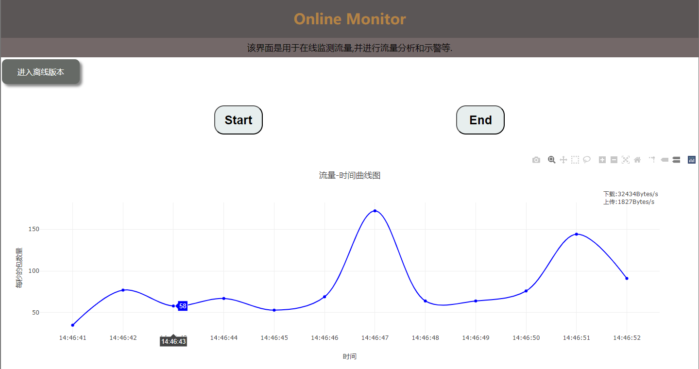
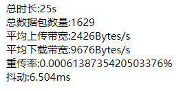
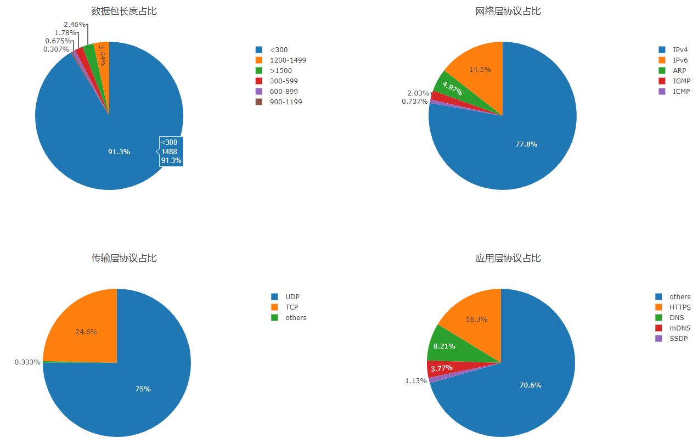
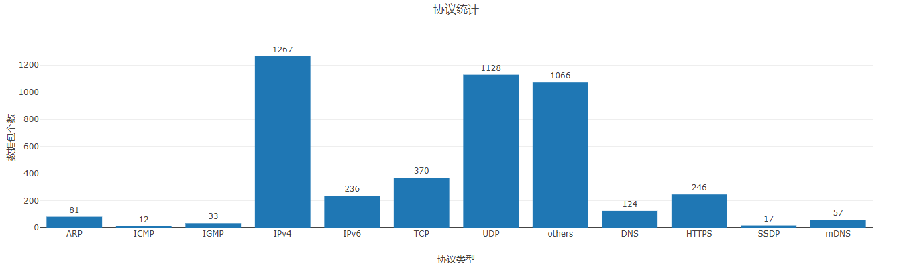
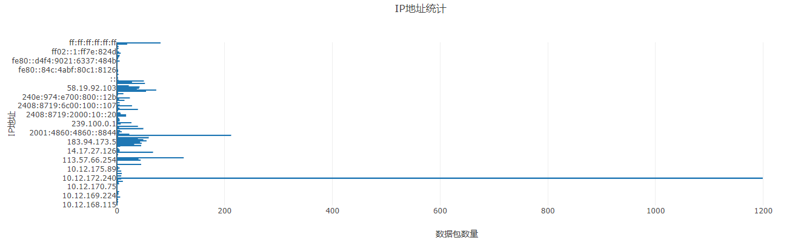
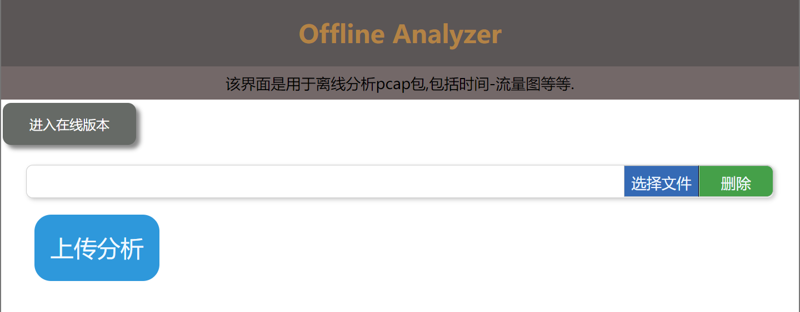
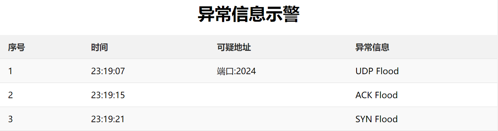

# readme将会按照下面目录进行项目说明：

| 1     | 实现效果     |
| ----- | :----------- |
| **2** | **环境需求** |
| **3** | **目录说明** |

## 1.实现效果

项目包含在线监听和离线分析两个模块。

在线监听能够实时在线监听流量变化详情，还能显示实时网速。运行程序后，点击Start按钮就会开始监听，如下图：

    图-在线流量监听

当点击End后，会给出是否保存为离线pcap文件的选择，默认保存在mycode目录下的pcap目录下，如果需要更改，请在app.py中@app.route('/save_pcap')视图函数更改。

End同时会出现离线分析的结果，包括：

图-通信质量分析

    图-四层协议占比

    图-所有协议统计

    图-ip地址统计

至于离线分析部分，程序执行开始可以选择进入离线分析，如下图：

    图-离线分析选择界面

需要注意的是，代码默认离线分析文件放在mycode目录下的offline-pcap文件下，如果需要更改，请在app.py中的@app.route('/offline_analysis')视图函数中更改。

另外需要注意，程序运行后，只能选择进行在线或者离线分析一次，如果需要多种功能，请停止程序重新运行。

在线监听过程中可以实现对部分DDos攻击的预警，模拟攻击的代码在mycode中的attack目录下，实现了三种DDos攻击（小范围模拟），预警效果如下：

    图-攻击示警

注意：代码中只简单写了这三种攻击的预警，而且数据设计得比较小，所以可能会出现误判的情况。

## 2.环境需求

目前代码是在Windows11环境下测试的，监听的网卡设置为“WLAN”，Linux未测试，但是应该只是改一改网卡的事。其他环境依赖包见：mycode目录中的requirements.txt。

## 3.目录说明

1.attack目录是放置测试攻击代码的目录

2.pcap目录是在线报文为本地pcap目录的位置

3.offline-pcap目录是测试本地分析时文件默认放置的位

4.static目录放置css和js文件

5.templates目录放置两个静态HTML文件

6.src目录是readme的图片保存处

7.主目录为后端代码所在,程序入口在app.py